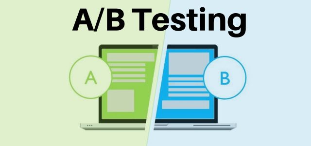

# AB_TESTING_LANDING_PAGE


## Описание проекта

Цель проекта — проанализировать эффективность двух вариантов посадочной страницы турагентства по ключевым метрикам: **конверсии покупки** и **ежедневному среднему чеку**.

Основные задачи:

* убедиться, что A/B-тестирование было проведено корректно (чистка данных, проверка длительности теста, исключение пересечений пользователей),
* проверить факт стабилизации метрик во времени,
* провести статистический анализ (t-тесты, Z-тесты, доверительные интервалы),
* дать бизнес-ответ: какой вариант страницы более предпочтителен.

## Установка зависимостей

Проект выполнялся в виртуальной среде venv.

Перед запуском установите необходимые библиотеки:

```bash
    pip install -r requirements.txt
```

## Проект состоит из следующих этапов:

### 1. Анализ структуры и предобработка данных

* проверка формата данных, типов столбцов, пропусков и дублей
* исключение пользователей, попавших в обе группы
* проверка равенства длительности эксперимента

## 2. Первичный анализ результатов A/B-тестирования

* расчет вспомогательных показателей (визиты, покупки, выручка)
* расчет ключевых метрик: конверсия и средний чек
*  сравнение покупательской способности по ценам туров

## 3. Анализ стабилизации метрик

* расчет ежедневных и кумулятивных показателей
* построение графиков динамики конверсии и среднего чека
* проверка стабильности метрик во времени

## 4. Статистический анализ

* проверка нормальности распределений (Шапиро-Уилк)
* проверка равенства дисперсий (тест Левена)
* t-тест для сравнения ежедневных средних чеков
* Z-тест для сравнения конверсий

#### 4.1 построение 95% доверительных интервалов для:

- конверсий в каждой из групп
- разницы конверсий
- среднего чека в каждой из групп

## 5. Общий вывод

* по конверсии значимой разницы между A и B нет
* по среднему чеку вариант B значимо выше -> суммарная выручка больше
* рекомендация для бизнеса: использовать дизайн варианта B

## Используемые технологии

- Python 3.12+
- Pandas, NumPy
- Matplotlib, Seaborn
- SciPy (статистические тесты)
- Statsmodels (z-тест для пропорций)

| Метрика                      | Подход                                 | Вывод                                       |
| ---------------------------- | -------------------------------------- | ------------------------------------------- |
| **Конверсия**                | Z-тест для пропорций, 95% CI           | Разницы нет (p=0.238, CI включает 0)        |
| **Средний чек (ежедневный)** | t-тест (после Шапиро и Левена), 95% CI | Разница значима, B > A (CI не пересекаются) |
| **Стабильность метрик**      | Кумулятивные графики                   | Метрики стабилизировались → тест завершён   |

# Итог для бизнеса

* Конверсии у A и B одинаковы, статистически значимой разницы нет.
* Средний чек у группы B значимо выше → больше суммарная выручка при той же конверсии.
* **Рекомендация**: выбрать дизайн варианта B, так как он экономически эффективнее.